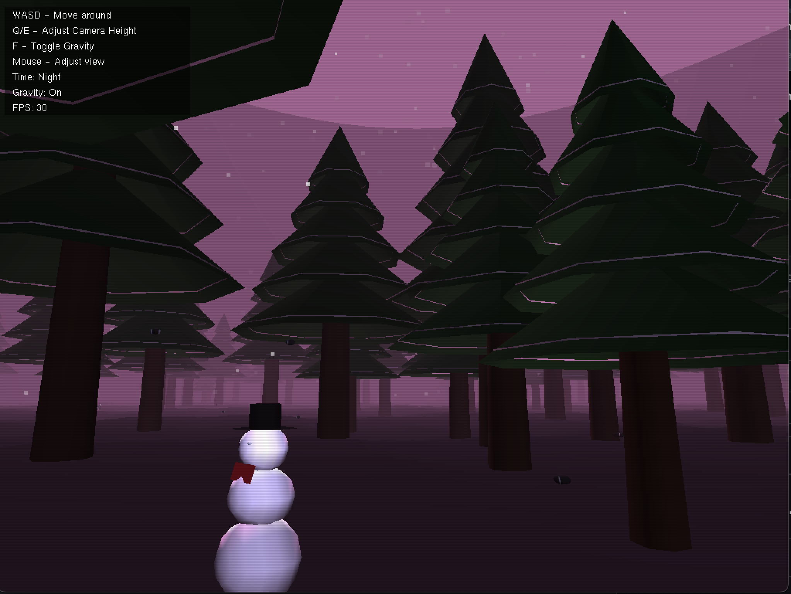

# 🎮 PySnow-GL

### A Winter Wonderland in OpenGL and Python



*A 3D winter scene implementation demonstrating graphics programming concepts without pre-made 3D models*

[](https://www.python.org/)
[](https://www.opengl.org/)
[](LICENSE)

## ✨ Features

- 🏔️ Basic procedural terrain generation
- ❄️ Particle system for snow effects
- 💡 Basic lighting implementation
- 🌫️ Simple fog effects
- 🎯 Basic physics for gravity
- 🦊 Simple AI for animal movement
- 📷 First-person camera system

## 🎮 Controls

| Key | Action |
|-----|--------|
| `W` | Move forward |
| `S` | Move backward |
| `A` | Move left |
| `D` | Move right |
| `Q` | Move up |
| `E` | Move down |
| `F` | Toggle gravity |
| `Mouse` | Click and hold to look around |

## 🚀 Getting Started

### Prerequisites

Make sure you have the following installed:
- Python 3
- OpenGL 4.5 or higher

### Installation

1. Clone the repository:
   ```bash
   git clone https://github.com/cosmini0/PySnow-GL.git
   ```

2. Navigate to the project directory:
   ```bash
   cd PySnow-GL
   ```

3. Install the required dependencies:
   ```bash
   pip3 install -r requirements.txt
   ```

4. Run the application:
   ```bash
   python3 PySnow_GL.py
   ```

## 📦 Dependencies

- [PyOpenGL](http://pyopengl.sourceforge.net/) - Python bindings for OpenGL
- [NumPy](https://numpy.org/) - Scientific computing library

## 🤝 Contributing

Contributions, issues, and feature requests are welcome! Feel free to check the [issues page](https://github.com/cosmini0/PySnow-GL/issues).

## 📝 License

This project is licensed under the MIT License - see the [LICENSE](LICENSE) file for details.

---

<div align="center">
Made with ❄️ by cosmini0
</div>
